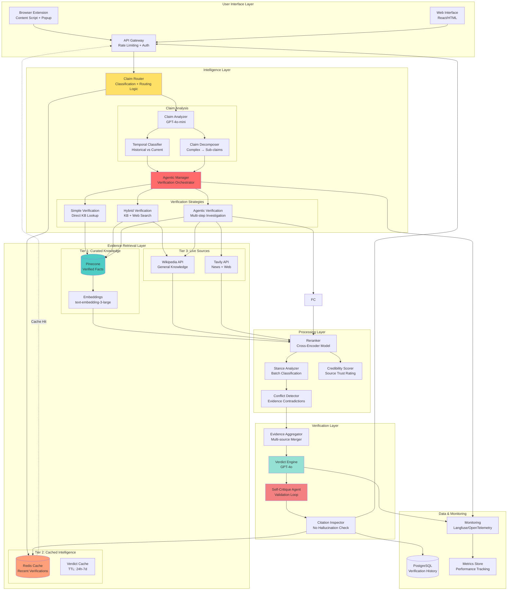

# Real-Time News Claim Verification System - Architecture

## Executive Summary

This architecture implements a **three-tier hybrid RAG system** with intelligent routing, multi-source evidence aggregation, and an agentic verification loop. It employs **adaptive retrieval strategies** that choose between static knowledge, live web search, and agentic investigation based on claim characteristics.

**Key Differentiators:**
- **Intelligent Claim Router**: Automatically classifies claims and routes to optimal verification strategy
- **Multi-Stage Verification**: Progressive verification with confidence-based escalation
- **Hybrid Knowledge Architecture**: Three-tier knowledge system (curated → cached → live)
- **Agentic Self-Critique**: Agent validates its own conclusions before presenting results
- **Temporal Intelligence**: Understands time-sensitive vs. historical claims
- **LangChain-Powered**: Production-grade orchestration with built-in observability and error handling

---

## Table of Contents
1. [System Architecture Diagram](#1-system-architecture-diagram)
2. [Detailed Component Descriptions](#2-detailed-component-descriptions)
3. [Data Flow: Complete Verification Journey](#3-data-flow-complete-verification-journey)
4. [Technical Specifications](#4-technical-specifications)
5. [LangChain Integration Strategy](#5-langchain-integration-strategy)
6. [Performance Characteristics](#6-performance-characteristics)
7. [Production Readiness: Security, Reliability & Monitoring](#7-production-readiness-security-reliability--monitoring)
8. [Deployment Architecture](#8-deployment-architecture)
9. [Addressing Problem Statement Requirements](#9-addressing-problem-statement-requirements)
10. [Success Metrics](#10-success-metrics)
11. [Implementation Roadmap](#11-implementation-roadmap)

---

## 1. System Architecture Diagram

